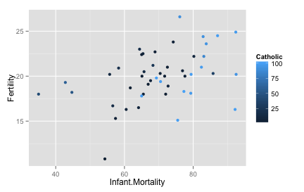

## The Application

**Goal**:
We aim to explore the relationships between six different measured indicators for 47 French-speaking provinces of Switzerland to learn more about the socio-economic and fertility health of the country. This should provide insight to the demographic shift of that time period.

</br>

**The Shiny App**:
The application developed and deployed by Shiny and R allows exploration of these relationships. The available capabilities of the app are:
- Able to plot a user-chosen x-variable and y-variable (out of Fertility, Agriculture, or Infant.Mortality)
- Colors of the plotted points can be changed to reflect the value and trend of an additional variable (Education, Examination, or Catholic)
- A simple linear regression can be fit to the plotted x and y variables. Results will be plotted; slope, intercept, and R-value are also printed below the plot (note: the fit is NOT by group)


---
## Plotting with the Shiny App
An example of one of the possible plots that can be made with the Shiny app is shown below, with Fertility plotted against Infant Mortality, grouped by the Catholic variable. A distinction can be seen between the two groupings and more can be learned when exploring the dataset in the app.


```r
library(ggplot2)
```

```
## Warning: package 'ggplot2' was built under R version 3.0.2
```

```
## Use suppressPackageStartupMessages to eliminate package startup messages.
```

```r
p = ggplot(data=swiss, aes(Fertility,Infant.Mortality, color = Catholic))
    p = p + geom_point() + xlab("Infant.Mortality") + ylab("Fertility")
    print(p)
```

 


--- 
## Final Summary

Examining the relationships between fertility, agriculture, infant health, etc. for these 47 French-speaking provinces of Switzerland can help us learn more about the demographic shift of that time period and how it may have been affected by immigration, emigration, and changes in government and religion. Explore these relationships yourself using the Shiny App!

*References*:</br>
- Mosteller, F. and Tukey, J. W. (1977).
- http://history-switzerland.geschichte-schweiz.ch/
- http://www.cicred.org/


